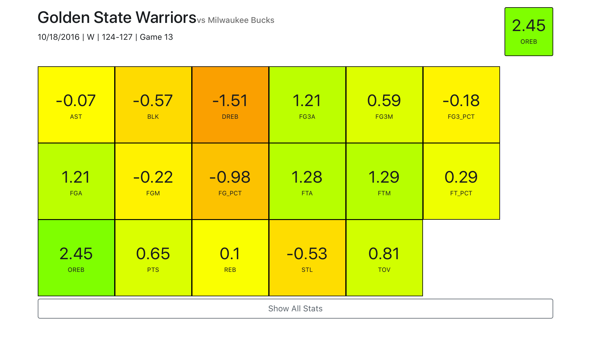
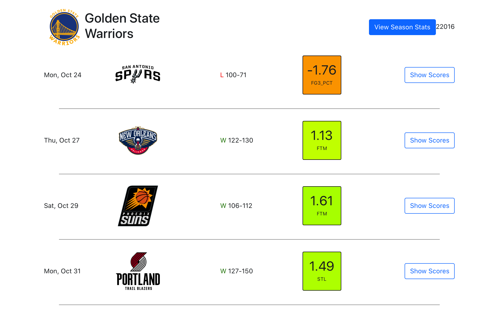
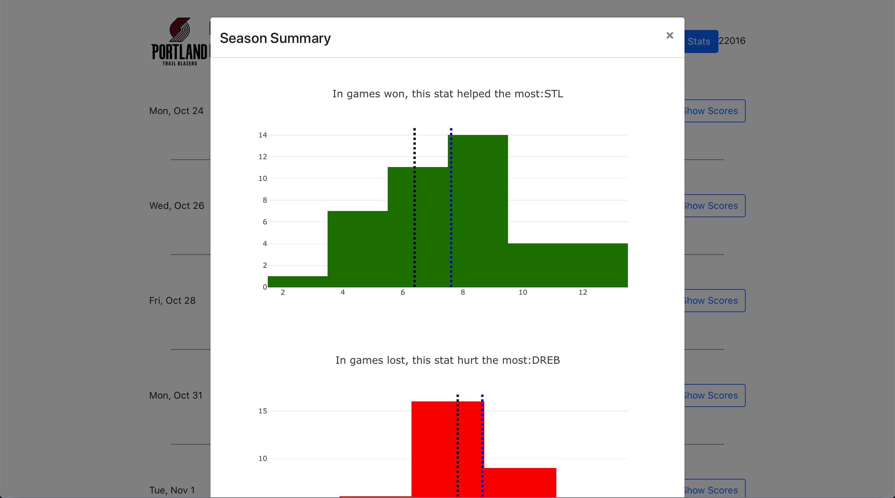

# Welcome to One Big Thing!

What is this? This is a project by Rohan Narayan to pull data about the "One Big Thing" (OBT) from each NBA game. This analysis is done by simply taking the z-score of all of the statistics available in the box score. The mean and standard deviation are taken from the team's average stats over the season–therefore, the "One Big Thing" is trying to find a statistic that "stood out" for the team in the win.

The backend logic for OBT is available here: https://github.com/rrnarayan1/one-big-thing-backend

I've attached screenshots of the website below for the public to get a sense of what this will look like.

## Available Scripts

In the project directory, you can run:

### `npm start`

Runs the app in the development mode. 
Open [http://localhost:3000](http://localhost:3000) to view it in the browser.

The page will reload if you make edits. 
You will also see any lint errors in the console.

This project was bootstrapped with [Create React App](https://github.com/facebook/create-react-app).

## Screenshots

#### Game Scores Page: 
Each stat for each game is assigned a score, which is the z-score of that stat for this team for that current season. It gives a sense of "how unusual" that number is for that team.

#### Team Season Log: 
Each game for that team is visible, as is the "one big thing" for that game. This is calculated by taking the stat with the highest z-score.

#### Team Season Summary: 
Currently, this modal only shows the statistic that was most often the OBT in wins, and the stat that was most often the OBT in losses, along with a histogram of those stats in games won and lost.

